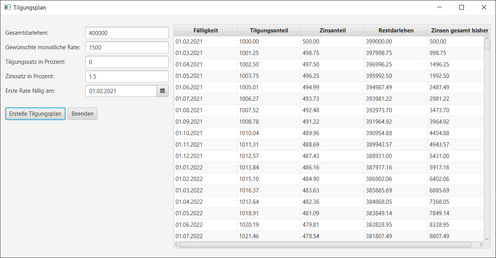

# Tilgungsplan

Simple Anwendung für die Kalkulation eines Annuitätendarlehens inklusive aller zu leistenden Zahlungen:
- Kalkulation und Darstellung aller monatlich zu leistenden Zahlungen bis zur vollständigen Rückzahlung des Darlehens
- Übersicht über Tilgungs- und Zinsanteil je monatlicher Zahlung
- Ausgabe der kumulierten Zinsen

